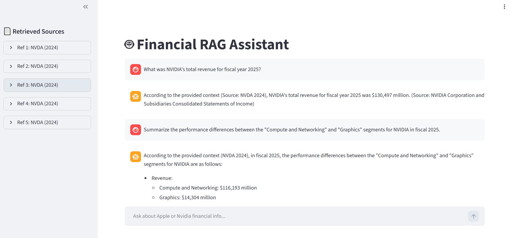

# 🤖 FinSearchAI: a RAG Assistant for Financial Insights



## 📖 Overview

FinSearch AI is a specialized Retrieval-Augmented Generation (RAG) system designed to answer financial queries using professional-grade open-source models. While standard RAG systems often struggle with the "noise" and structural complexity of financial data, this project implements a custom data-engineering pipeline to ensure high-fidelity retrieval and reasoning.

The system currently achieves an accuracy rate of about 73% (considering both correct and partially correct answers) in providing context-aware answers derived from 10-K filings of different companies.

## 📜 Steps

The RAG assistant works in a series of steps:

1. Download the 10-K filings for the choosen companies.
   
3. Preprocess the documents, split them into overlapping chunks based on HTML elements, extract metadata, generate document embeddings and store them on a vector store.
   
4. After formulating a financial query, embed it, retrieve the most relevant documents w.r.t. the query and pass them as context to an LLM, to generate the final answer.

Entering more into the details, the retrieval step consists in the following pipeline:

1. Hybrid (Ensemble) Retrieval: the search for relevant documents is performed both semantically (vector search) and syntacticaly (document search). These 2 processes, produce separate scores for the set of documents, which are then combined and used to find the top 20 documents.

2. Reranking: The 20 most relevant documents extracted by the previous step are reranked using a CrossEncoder, by computing a final relevance score for each couple query-document and the top 5 documents are returned and used to generate the answer to the query.

## 🛠️ Technical Details

- To develop the system, pure python is used (along with the APIs of the needed services). In a previous version of the project I was using the langchain framework but, since its recent updates were breaking everything, I decided to switch to pure python for better stability.

- The 10-K filings used for the system are from 5 companies: Apple (APPL), Nvidia (NVDA), Microsoft (MSFT), Tesla (TSLA) and Google (GOOGL).
  
- For the Hybrid Retrieval pipeline, the model used to generate the documents' embeddings is BAAI/bge-m3, via Hugging Face Inference Endpoints, while BM25 is used for document search.

- The CrossEncoder used for reranking is BAAI/bge-reranker-v2-m3, which belongs to the same family of the embedding model.

- The brain (LLM) used for answering the queries is llama-3.3-70b-versatile, via the Groq API.
  
- To store the documents embeddings and perform high-speed semantic search, Pinecone (Cloud Vector DB) is used.

## 🔎 Usage instructions

You can test the system at the link https://huggingface.co/spaces/andreagalasso99/financial-rag-assistant.

Alternatively, you can run it locally in the following way:

### Clone the repository 

```sh 
git clone https://github.com/galassoandrea/rag-assistant.git
```

### Get you API keys for Groq and Pinecone

Store them in a .env file and create a Pinecone index (you can do it through the UI).

### Install dependencies

```sh 
pip install -r requirements.txt
```

### Automatically download the 10-K filings

 You need to set a valid email address inside the script.

```sh 
python scripts/download_data.py
```

### Run the ingestion script

Create the document embeddings and store them in your Pinecone index.

```sh 
python scripts/ingest.py
```

### Launch the application

You will be redirected to a generated streamlit UI, which will allow you to interact with the system.

```sh 
streamlit run app.py
```

To test the system, you can use the following queries, grouped by complexity level, which have been generated by NotebookLM, by loading into it the original documents, let it analyze them carefully and finally generate the queries.
The queries have then been validated first by me, and then by Gemini 3 Pro, by passing to it the queries, the true answers extracted from the documents by NotebookLM and the answers generated by the RAG system and let it judge if the generated answers are coherent with the true ones or not.

### Level 1: Basic Retrieval

These queries test the RAG system’s ability to locate specific numerical values, dates, or basic facts within a single document.

- Query 1 (Apple): What was Apple's total net sales for the fiscal year ended September 27, 2025, and which geographic segment generated the highest revenue?

- Query 2 (Alphabet): How many shares of Alphabet's Class A stock were outstanding as of January 28, 2026?

- Query 3 (Nvidia): What was the total dollar amount of the charge Nvidia incurred in the first quarter of fiscal year 2026 associated with its H20 integrated circuits?

- Query 4 (Tesla): How many consumer vehicles did Tesla produce and deliver in the year ended December 31, 2025?

- Query 5 (Microsoft): By what amount and percentage did Microsoft's Intelligent Cloud revenue increase from fiscal year 2024 to 2025?

### Level 2: Aggregation & Synthesis

These queries require the RAG system to pull information from multiple sections within a single document, synthesizing financial data with strategic narratives or risk factors.

- Query 6 (Alphabet): Identify the two pending acquisitions Alphabet announced in 2025. What is the expected purchase price and target closing timeframe for each?

- Query 7 (Tesla): Summarize the legal and operational status of Elon Musk's 2018 and 2025 CEO Performance Awards. How do the "double dip" provisions of the 2025 award function?

- Query 8 (Nvidia): How have U.S. government export controls impacted Nvidia's business operations and product roadmap, particularly regarding the China market?

- Query 9 (Microsoft): What are the primary components of Microsoft's Productivity and Business Processes segment, and what factors drove its revenue growth in fiscal year 2025?


### Level 3: Cross-Document Comparison

These queries test the system's ability to retrieve and accurately compare financial metrics, strategies, or risk profiles across multiple companies.

- Query 10 (Macro & Geopolitics): Compare how Apple and Nvidia describe the supply chain risks associated with their reliance on manufacturing partners in China and Taiwan.

- Query 11 (AI Strategy): Based on the 2025 annual reports, how do Microsoft and Alphabet differentiate their cloud AI infrastructure and developer offerings (Azure AI vs. Google Cloud AI)?

- Query 12 (Capital Returns): Compare the total dollar amount spent on common stock share repurchases in the most recent fiscal year by Apple and Alphabet.

### Level 4: Complex Reasoning & Financial Logic

These queries require complex reasoning, calculations, or an understanding of nuanced accounting and regulatory impacts.

- Query 13 (Margin Analysis): Calculate and explain the year-over-year change in Nvidia's gross margin percentage from fiscal year 2025 to fiscal year 2026. What specific operational factors and accounting charges drove this change?

- Query 14 (Tax & Regulatory Impact): How did the newly enacted U.S. One Big Beautiful Bill Act (OBBBA) and the OECD's Pillar Two global minimum tax affect the effective tax rates and deferred tax assets of Tesla and Microsoft?

- Query 15 (Revenue Recognition): Analyze Microsoft's unearned revenue and remaining performance obligations as of June 30, 2025. How much total revenue is allocated to remaining performance obligations, and what percentage of that is expected to be recognized over the next 12 months?